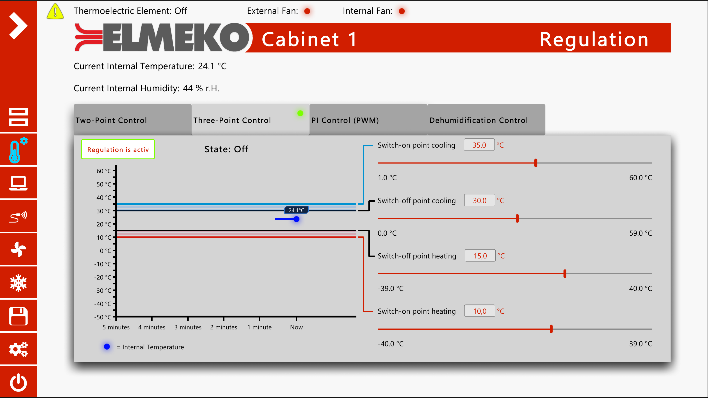

# TPC Monitor

This software was developed for the [TPC 300 from ELMEKO](https://www.elmeko.de/de/details/peltier-controller-tpc-300). The TPC 300 is a multifunctional controller for controlling and monitoring Peltier cooling units and dehumidifiers. In addition to 4 different control programs, there are extensive monitoring options and a serial interface that enables simple configuration, communication and visualisation.

    Key aspects:

    - Json based communication
    - Gets updates from the controllers every few seconds
    - The controllers firmware can be updated by this program
    - Monitoring can be recorded over several hours
    - Displays error messages and their possible causes

# Content

## Dashboard

The dashboard shows all to the computer connected TPC 300 controllers. A controller can be selected from this list in order to actively monitor it and make settings.
The fan or dehumidifier connected to the controller is displayed in the center.
The most important data is displayed on the right side.

## Regulation

One of the four control types can be selected and monitored in this menu.

## Monitoring

Error messages and their possible causes and solutions are displayed here.
In the Parameters submenu, values such as undervoltage and overvoltage can also be regulated.

## Sensors

Up to four temperature sensors and humidity sensors can be connected to the controller. The corresponding function can be assigned to them in this menu. However, a sensor for the indoor temperature is mandatory.
Limit values for the temperature can be defined on the right side. If the temperature falls below or exceeds these, this triggers an error.

## Fans

The behaviour of the fans can be set in this menu.

## Select Cooling Unit

Many different cooling units and dehumidifiers can be connected to the TPC 300 Controller.
The device connected to the controller can be selected here to load the corresponding default values. When connecting for the first time, the programme attempts to determine the device automatically.
If there is no suitable device in the list, the user can create their own device with their own defined values.

## Record

All values and error messages can be recorded in this menu for a definable period of time.
These can either be saved on an SD card, which can be inserted into the controller, or on the connected computer at a definable path as an Excel file.
The running record can be viewed in the ‘Running Record’ submenu.

## Settings

In this menu, updates for the firmware of the controller and the TPC Monitor software itself can be loaded, among other things.
The versions of both programmes are checked at regular intervals. If an update is available, the user can download and install it by clicking on a button.
The controller firmware can also be updated manually via the computer or an SD card if the user has a .bin file of the firmware.

The buttons on the right-hand side can be used to reset the controller or to save or load the current values.
The values are saved and loaded as a json file.
This can be useful if you want to set up the controller quickly with predefined values.

# Code samples

## TPC Firmware Updater ([View Script](scripts/TPCFirmwareUpdater.cs))

This script updates the firmware of the controller via the serial port and displays the progress of the installation in a pop-up window.
First, the CRC-32 value and the page size are determined and sent to the controller together with the file size.
Then the installation file is divided into 4096 byte chunks and sent to the controller one after the other.

## Recording ([View Script](scripts/Record.cs))

With this script, the most important values and error messages can be saved cyclically in an excel file on the PC. Alternatively, a signal can be sent to the controller to save to an SD card.

## XPC Reader ([View Script](scripts/XPCReader.cs))

The XPCReader is used to check serial ports for possible connected TPC controllers.
The current data is obtained from these at regular intervals. In addition, any changes made to the values are sent to the respective controller.

## Serial Converter ([View Script](scripts/SerialConverter.cs))

Converts a json value by the given name to a string, float, int, or bool and calls the corresponding event.

In this example, the value of a slider is adjusted if a json value with the name L1NZ has arrived via the serial port.
